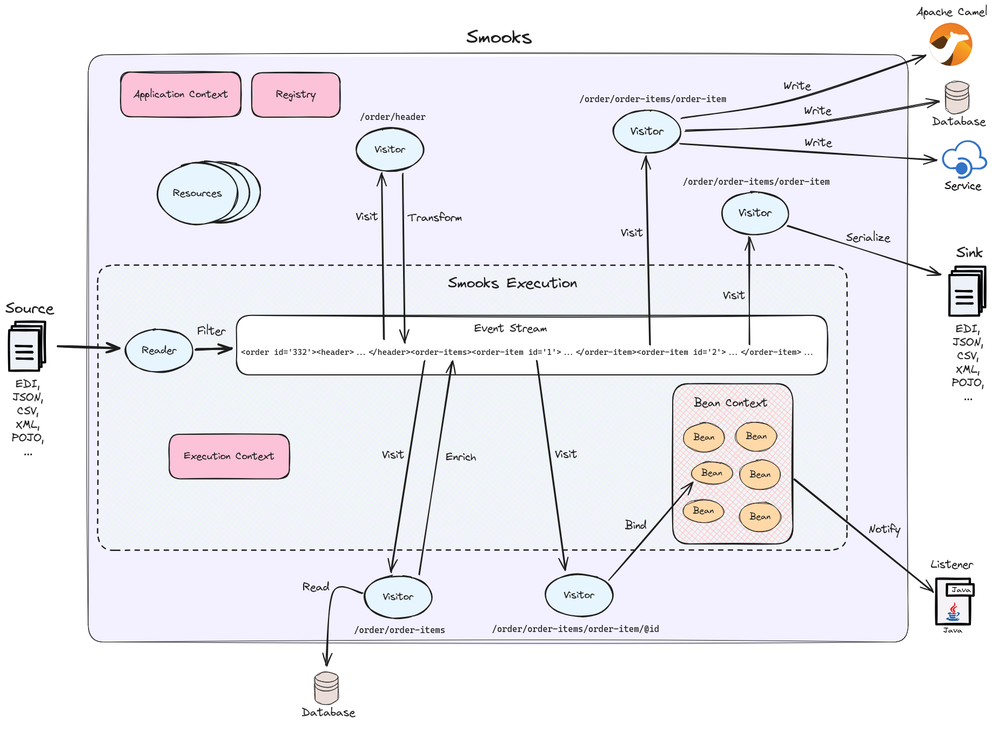

= Smooks
:toc: macro
:!toc-title:
:toclevels:3

image:https://img.shields.io/maven-central/v/org.smooks/smooks[Maven Central]
image:https://img.shields.io/nexus/s/org.smooks/smooks?server=https%3A%2F%2Foss.sonatype.org[Sonatype Nexus (Snapshots)]
image:https://github.com/smooks/smooks/workflows/CI/badge.svg[Build Status]

This is the Git source code repository for the http://www.smooks.org[Smooks] project.

toc::[]

== Building

=== Prerequisites

* JDK 8 or higher
* Apache Maven 3.2.x

=== Maven

. `git clone git://github.com/smooks/smooks.git`
. `cd smooks`
. `mvn clean install`

NOTE: You will need both Maven (version 3.2.x) and Git installed on your local machine.

// tag::getting-started[]
== Getting Started

The easiest way to get started with Smooks is to download and try out the https://github.com/smooks/smooks-examples/tree/v1.0.5[examples]. The examples are the recommended base upon which to integrate Smooks into your application.
// end::getting-started[]

// tag::introduction[]
== Introduction

Smooks is an extensible Java framework for building XML and non-XML data (CSV, EDI, POJOs, etc...) fragment-based applications. It can be used as a lightweight framework on which to hook your own processing logic for a wide range of data formats but, out-of-the-box, Smooks ships with features that can be used individually or seamlessly together:

* *Java Binding*: Populate POJOs from a source (CSV, EDI, XML, POJOs, etc...). Populated POJOs can either be the final result of a transformation, or serve as a bridge for further transformations like what is seen in template resources which generate textual results such as XML. Additionally, Smooks supports collections (maps and lists of typed data) that can be referenced from expression languages and templates.

* *Transformation*: perform a wide range of data transformations and mappings. XML to XML, CSV to XML, EDI to XML, XML to EDI, XML to CSV, POJO to XML, POJO to EDI, POJO to CSV, etc...

* *Templating*: extensible template-driven transformations, with support for https://www.w3.org/TR/xslt/[XSLT], https://freemarker.apache.org/[FreeMarker], and https://www.stringtemplate.org/[StringTemplate].

* *Huge Message Processing*: process huge messages (gigabytes!). Split, transform and route fragments to JMS, filesystem, database, and other destinations.

* *Fragment Enrichment*: enrich fragments with data from a database or other data sources.

* *Complex Fragment Validation*: rule-based fragment validation.

* *Fragment Persistence*: read fragments from, and save fragments to, a database with either JDBC, persistence frameworks (like MyBatis, Hibernate, or any JPA compatible framework), or DAOs.

* *Combine*: leverage Smooks's transformation, routing and persistence functionality for _Extract Transform Load_ (ETL) operations.

* *Validation*: perform basic or complex validation on fragment content. This is more than simple type/value-range validation.

=== Why Smooks?

Smooks was conceived to perform _fragment-based transformations_ on messages. Supporting fragment-based transformation opened up the possibility of mixing and matching different technologies within the context of a single transformation. This meant that one could leverage distinct technologies for transforming fragments, depending on the type of transformation required by the fragment in question.

In the process of evolving this fragment-based transformation solution, it dawned on us that we were establishing a fragment-based processing paradigm. Concretely, a framework was being built for targeting custom link:#visitors[visitor] logic at message fragments. A visitor does not need to be restricted to transformation. A visitor could be implemented to apply all sorts of operations on fragments, and therefore, the message as a whole.

Smooks supports a wide range of data structures - XML, EDI, JSON, CSV, POJOs (POJO to POJO!). A pluggable reader interface allows you to plug in a reader implementation for any data format.

=== Fragment-Based Processing

The primary design goal of Smooks is to provide a framework that isolates and processes fragments in structured data (XML and non-XML) using existing data processing technologies (such as XSLT, plain vanilla Java, Groovy script).

A visitor targets a fragment with the visitor's resource _selector_ value. The targeted fragment can take in as much or as little of the source stream as you like. A fragment is identified by the name of the node enclosing the fragment. You can target the whole stream using the node name of the root node as the selector or through the reserved `+#document+` selector.

NOTE: The terms _fragment_ and _node_ denote different meanings. It is usually acceptable to use the terms interchangeably because the difference is subtle and, more often than not, irrelevant. A _node_ may be the outer node of a fragment, excluding the child nodes. A _fragment_ is the outer node and all its child nodes along with their character nodes (text, etc...). When a visitor targets a node, it typically means that the visitor can only process the fragment's outer node as opposed to the fragment as a whole, that is, the outer node and its child nodes

=== What's new in Smooks 2?

Smooks 2 introduces the https://github.com/smooks/smooks-dfdl-cartridge[DFDL cartridge] and revamps its https://github.com/smooks/smooks-edi-cartridge[EDI cartridge], while dropping support for Java 7 along with other notable changes:

* DFDL cartridge
    ** DFDL is a specification for describing file formats in XML. The DFDL cartridge leverages https://daffodil.apache.org/[Apache Daffodil] to parse files and unparse XML. This opens up Smooks to a wide array of data formats like SWIFT, ISO8583, HL7, and many more.
* Added compatibility with Java 9 and later versions; retained compatibility for Java 8
* link:#pipeline[Pipeline support]
    ** Compose any series of transformations on an event outside the main execution context before directing the pipeline output to the execution result stream or to other destinations
* Complete overhaul of the EDI cartridge
    ** Rewritten to extend the DFDL cartridge and provide much better support for reading EDI documents
    ** Added functionality to serialize EDI documents
    ** As in previous Smooks versions, incorporated special support for EDIFACT
* SAX NG filter
    ** Replaces SAX filter and supersedes DOM filter
    ** Brings with it a new visitor API which unifies the SAX and DOM visitor APIs
    ** Cartridges migrated to SAX NG
    ** Supports XSLT and StringTemplate resources unlike the legacy SAX filter
* Mementos: a convenient way to stash and un-stash a visitor's state during its execution lifecycle
* Independent release cycles for all cartridges and one https://www.smooks.org/maven[Maven BOM] (bill of materials) to track them all
* License change
    ** After reaching consensus among our code contributors, we've dual-licensed Smooks under https://choosealicense.com/licenses/lgpl-3.0/[LGPL v3.0] and https://choosealicense.com/licenses/apache-2.0/[Apache License 2.0]. This license change keeps Smooks open source while adopting a permissive stance to modifications.
* New Smooks XSD schema (`+xmlns="https://www.smooks.org/xsd/smooks-2.0.xsd"+`)
    ** Uniform XML namespace declarations: dropped `+default-selector-namespace+` and `+selector-namespace+` XML attributes in favour of declaring namespaces within the standard `+xmlns+` attribute from the `+smooks-resource-config+` element.
    ** Removed `+default-selector+` attribute from `+smooks-resource-config+` element: selectors need to be set explicitly
* Dropped Smooks-specific annotations in favour of JSR annotations
    ** Farewell `+@ConfigParam+`, `+@Config+`, `+@AppContext+`, and `+@StreamResultWriter+`. Welcome `+@Inject+`.
    ** Farewell `+@Initialize+` and `+@Uninitialize+`. Welcome `+@PostConstruct+` and `+@PreDestroy+`.
* Separate top-level Java namespaces for API and implementation to provide a cleaner and more intuitive package structure: API interfaces and internal classes were relocated to `+org.smooks.api+` and `+org.smooks.engine+` respectively
* Improved XPath support for resource selectors
    ** Functions like `not()` are now supported
* Numerous dependency updates
* Maven coordinates change: we are now publishing Smooks artifacts under Maven group IDs prefixed with `+org.smooks+`
* Replaced default SAX parser implementation from Apache Xerces to https://github.com/FasterXML/woodstox[FasterXML's Woodstox]: benchmarks consistently showed Woodstox outperforming Xerces

=== Migrating from Smooks 1.7 to 2.0

Comparing the https://github.com/smooks/smooks/tree/v1.7.1/smooks-examples[code examples] for Smooks 1 with https://github.com/smooks/smooks-examples/tree/v1.0.5[those for Smooks 2] can be a useful guide in migrating to Smooks 2. While not exhaustive, we have compiled a list of notes to assist your migration:

. Smooks 2 no longer supports Java 7. Your application needs to be compiled to at least Java 8 to run Smooks 2.
. Replace class interfaces:
    * `org.milyn.delivery.ExecutionLifecycleInitializable` with `org.smooks.api.lifecycle.PreExecutionLifecycle`
    * `org.milyn.delivery.ExecutionLifecycleCleanable` with `org.smooks.api.lifecycle.PostExecutionLifecycle`
    * `org.milyn.delivery.VisitLifecycleCleanable` with `org.smooks.api.lifecycle.PostFragmentLifecycle`
    * `org.milyn.delivery.ConfigurationExpander` with `org.smooks.api.delivery.ResourceConfigExpander`
. Remove references to  `org.milyn.util.CollectionsUtil` and write your own implementation for this class.
. Implement from `org.smooks.api.resource.visitor.sax.ng.SaxNgVisitor` instead of `org.milyn.delivery.sax.SAXVisitor`.
. Replace `Smooks#addConfiguration(...)` method calls with `Smooks#addResourceConfig(...)`.
. Replace `org.milyn.*` Java package references with `org.smooks.api`, `org.smooks.engine`, `org.smooks.io` or `org.smooks.support`.
. Change legacy document root fragment selectors from `$document` to `#document`.
. Remove the `milyn-smooks-all` dependency from the Maven POM and import the https://www.smooks.org/maven#bill_of_materials_bom[Smooks BOM] instead. Declare the corresponding dependency of each Smooks cartridge used within the project but omit the artifact version.
. Replace Smooks Maven coordinates to match the coordinates as described in the https://www.smooks.org/maven[Maven guide].
. Replace `ExecutionContext#isDefaultSerializationOn()` method calls with
`ExecutionContext#getContentDeliveryRuntime().getDeliveryConfig().isDefaultSerializationOn()`.
. Replace `ExecutionContext#getContext()` method calls with `ExecutionContext#getApplicationContext()`.
. Replace `org.milyn.delivery.dom.serialize.Serializer` references with `org.smooks.api.resource.visitor.SerializerVisitor`.
. Replace `org.smooks.cdr.annotation.AppContext` annotations with `javax.inject.Inject` annotations.
. Replace `org.smooks.cdr.annotation.ConfigParam` annotations with `javax.inject.Inject` annotations:
    * Substitute the `@ConfigParam` name attribute with the `@javax.inject.Named` annotation.
    * Wrap `java.util.Optional` around the field to mimic the behaviour of the `@ConfigParam` optional attribute.
. Replace `org.smooks.delivery.annotation.Initialize` annotations with `jakarta.annotation.PostConstruct` annotations.
. Replace `org.smooks.delivery.annotation.Uninitialize` annotations with `jakarta.annotation.PreDestroy` annotations.
. Replace references to `org.smooks.javabean.DataDecode` with `org.smooks.api.converter.TypeConverterFactory`.
. Replace references to `org.smooks.cdr.annotation.Configurator` with `org.smooks.api.lifecycle.LifecycleManager`.
. Replace references to `org.smooks.javabean.DataDecoderException` with `org.smooks.api.converter.TypeConverterException`.
. Replace references to `org.smooks.cdr.SmooksResourceConfigurationStore` with `org.smooks.api.Registry`.
. Replace references to `org.milyn.cdr.SmooksResourceConfiguration` with `org.smooks.api.resource.config.ResourceConfig`.
    * Replace calls to `setDefaultResource()` with `setSystem()`
    * Replace calls to `isDefaultResource()` with `isSystem()`
. Replace references to `org.milyn.delivery.sax.SAXToXMLWriter` with `org.smooks.io.DomSerializer`.
. Follow the https://github.com/smooks/smooks-examples/tree/master/edifact-to-java[EDIFACT-to-Java example] to migrate an implementation that binds an EDIFACT document to a POJO.
. Follow the https://github.com/smooks/smooks-examples/tree/master/java-to-edifact[Java-to-EDIFACT example] to migrate an implementation that deserialises a POJO into an EDIFACT document.
. Set `ContainerResourceLocator` from `DefaultApplicationContextBuilder#setResourceLocator` instead from `ApplicationContext#setResourceLocator`.

=== FAQs

See the https://www.smooks.org/faq[FAQ].

=== Maven

See the https://www.smooks.org/maven[Maven guide] for details on how to integrate Smooks into your project via Maven.
// end::introduction[]

// tag::fundamentals[]
== Fundamentals

A commonly accepted definition of Smooks is of it being a _Transformation Engine_. Nonetheless, at its core, Smooks makes no reference to _data transformation_. The core codebase is designed to hook visitor logic into an event stream produced from a source of some kind. As such, in its most distilled form, Smooks is a _Structured Data Event Stream Processor_.

An application of a structured data event processor is transformation. In implementation terms, a Smooks transformation solution is a visitor reading the event stream from a source to produce a different representation of the input. However, Smooks's core capabilities enable much more than transformation. A range of other solutions can be implemented based on the fragment-based processing model:

* *Java binding*: population of a POJO from the source.

* *splitting & routing*: perform complex splitting and routing operations on the source stream, including routing data in different formats (XML, EDI, CSV, POJO, etc...) to multiple destinations concurrently.

* *huge message processing*: declaratively consume (transform, or split and route) huge messages without writing boilerplate code.

The following gives a 10,000 foot view of Smooks:

Smooks's fundamental behaviour is to take an input _source_, such as CSV, and from it generate an _event stream_ to which _visitors_ are applied to produce a _result_, such as EDI. In Smooks nomenclature, this behaviour is called filtering. During filtering, you have other Smooks actors which are participating, including:

* resources
* application context
* execution context
* bean context
* registry
* listeners

All of these actors are explained in later sections.

Several sources and result types are supported which equate to different transformation types, including but not limited to:

* XML to XML
* XML to POJO
* POJO to XML
* POJO to POJO
* EDI to XML
* EDI to POJO
* POJO to EDI
* CSV to XML
* CSV to ...
* ... to ...

Smooks maps the source to the result with the help of a highly-tunable SAX event model. The hierarchical events generated from an XML source (_startElement_, _endElement_, etc...) drive the SAX event model though the event model can be just as easily applied to other structured data sources (EDI, CSV, POJO, etc...). The most important events are typically the _before_ and _after_ visit events. The following illustration conveys the hierarchical nature of these events.

image:docs/images/Event-model.gif[Image:event-model.gif]

=== Hello World App

One or more of https://www.smooks.org/javadoc/v2.0.0-RC3/smooks/org/smooks/api/resource/visitor/sax/ng/SaxNgVisitor.html[SaxNgVisitor] interfaces need to be implemented in order to consume the SAX event stream produced from the source, depending on which events are of interest.

The following is a hello world app demonstrating how to implement a visitor that is fired on the `+visitBefore+` and `+visitAfter+` events of a targeted node in the event stream. In this case, Smooks configures the visitor to target element `+foo+`:

The visitor implementation is straightforward: one method implementation per event. As shown above, a Smooks config (more about `+resource-config+` later on) is written to target the visitor at a node's `+visitBefore+` and `+visitAfter+` events.

The Java code executing the hello world app is a two-liner:

[source,java]
----
Smooks smooks = new Smooks("/smooks/echo-example.xml");
smooks.filterSource(new StreamSource(inputStream));
----

Observe that in this case the program does not produce a result. The program does not even interact with the filtering process in any way because it does not provide an https://www.smooks.org/javadoc/v2.0.0-RC3/smooks/org/smooks/api/ExecutionContext.html[`+ExecutionContext+`] to https://www.smooks.org/javadoc/v2.0.0-RC3/smooks/org/smooks/Smooks.html[`+smooks.filterSource(...)+`].

This example illustrated the lower level mechanics of the Smooks's programming model. In reality, most users are not going to want to solve their problems at this level of detail. Smooks ships with substantial pre-built functionality, that is, pre-built visitors. Visitors are bundled based on functionality: these bundles are called _Cartridges_.

=== Smooks Resources

A Smooks execution consumes an source of one form or another (XML, EDI, POJO, JSON, CSV, etc...), and from it, generates an event stream that fires different visitors (Java, Groovy, DFDL, XSLT, etc...). The goal of this process can be to produce a new result stream in a different format (data transformation), bind data from the source to POJOs and produce a populated Java object graph (Java binding), produce many fragments (splitting), and so on.

At its core, Smooks views visitors and other abstractions as resources. A _resource_ is applied when a _selector_ matches a node in the event stream. The generality of such a processing model can be daunting from a usability perspective because resources are not tied to a particular domain. To counteract this, Smooks 1.1 introduced an _Extensible Configuration Model_ feature that allows specific resource types to be specified in the configuration using dedicated XSD namespaces of their own. Instead of having a generic resource config such as:

[source,xml]
----
<resource-config selector="order-item">
    <resource type="ftl"><!-- <item>
    <id>${.vars["order-item"].@id}</id>
    <productId>${.vars["order-item"].product}</productId>
    <quantity>${.vars["order-item"].quantity}</quantity>
    <price>${.vars["order-item"].price}</price>
</item>
    -->
    </resource>
</resource-config>
----

an Extensible Configuration Model allows us to have a domain-specific resource config:

[source,xml]
----
<ftl:freemarker applyOnElement="order-item">
    <ftl:template><!-- <item>
    <id>${.vars["order-item"].@id}</id>
    <productId>${.vars["order-item"].product}</productId>
    <quantity>${.vars["order-item"].quantity}</quantity>
    <price>${.vars["order-item"].price}</price>
</item>
    -->
    </ftl:template>
</ftl:freemarker>
----

When comparing the above snippets, the latter resource has:

. A more strongly typed domain specific configuration and so is easier to read,
. Auto-completion support from the user's IDE because the Smooks 1.1+ configurations are XSD-based, and
. No need set the resource type in its configuration.

==== Visitors

Central to how Smooks works is the concept of a visitor. A visitor is a Java class performing a specific task on the targeted fragment such as applying an XSLT script, binding fragment data to a POJO, validate fragments, etc...

==== Selectors

Resource selectors are another central concept in Smooks. A selector chooses the node/s a visitor should visit, as well working as a simple opaque lookup value for non-visitor logic.

When the resource is a visitor, Smooks will interpret the selector as an http://www.w3.org/TR/xpath/[XPath-like] expression. There are a number of things to be aware of:

. The order in which the XPath expression is applied is the reverse of a normal order, like what hapens in an XSLT script. Smooks inspects backwards from the targeted fragment node, as opposed to  forwards from the root node.
. Not all of the XPath specification is supported. A selector supports the following XPath syntax:
    * `+text()+` and attribute value selectors: `+a/b[text() = 'abc']+`, `+a/b[text() = 123]+`, `+a/b[@id = 'abc']+`, `+a/b[@id = 123]+`.
        ** `+text()+` is only supported on the last selector step in an expression: `+a/b[text() = 'abc']+` is legal while `+a/b[text() = 'abc']/c+` is illegal.
        ** `+text()+` is only supported on visitor implementations that implement the `+AfterVisitor+` interface *only*. If the visitor implements the `+BeforeVisitor+` or `+ChildrenVisitor+` interfaces, an error will result.
    * `+or+` & `+and+` logical operations: `+a/b[text() = 'abc' and @id = 123]+`, `+a/b[text() = 'abc' or @id = 123]+`
    * Namespaces on both the elements and attributes: `+a:order/b:address[@b:city = 'NY']+`.
+
NOTE: This requires the namespace prefix-to-URI mappings to be defined. A configuration error will result if not defined. Read the link:#namespace-declaration[namespace declaration] section for more details.
+
    * Supports `+=+` (equals), `+!=+` (not equals), `+<+` (less than), `+>+` (greater than).
    * Index selectors: `+a/b[3]+`.

==== Namespace Declaration

The `+xmlns+` attribute is used to bind a selector prefix to a namespace:

[source,xml]
----
<?xml version="1.0"?>
<smooks-resource-list xmlns="https://www.smooks.org/xsd/smooks-2.0.xsd"
                      xmlns:c="http://c" xmlns:d="http://d">

    <resource-config selector="c:item[@c:code = '8655']/d:units[text() = 1]">
        <resource>com.acme.visitors.MyCustomVisitorImpl</resource>
    </resource-config>

</smooks-resource-list>
----

Alternatively, namespace prefix-to-URI mappings can be declared using the legacy core config `+namespace+` element:

[source,xml]
----
<?xml version="1.0"?>
<smooks-resource-list xmlns="https://www.smooks.org/xsd/smooks-2.0.xsd"
                      xmlns:core="https://www.smooks.org/xsd/smooks/smooks-core-1.6.xsd">

    <core:namespaces>
        <core:namespace prefix="c" uri="http://c"/>
        <core:namespace prefix="d" uri="http://d"/>
    </core:namespaces>

    <resource-config selector="c:item[@c:code = '8655']/d:units[text() = 1]">
        <resource>com.acme.visitors.MyCustomVisitorImpl</resource>
    </resource-config>

</smooks-resource-list>
----

=== Input

Smooks relies on a _Reader_ for ingesting a source and generating a SAX event stream. A reader is any class extending https://docs.oracle.com/javase/8/docs/api/org/xml/sax/XMLReader.html[`+XMLReader+`]. By default, Smooks uses the `+XMLReader+` returned from https://docs.oracle.com/javase/8/docs/api/org/xml/sax/helpers/XMLReaderFactory.html[`+XMLReaderFactory.createXMLReader()+`]. You can easily implement your own `+XMLReader+` to create a non-XML reader that generates the source event stream for Smooks to process:

[source,xml]
----
<?xml version="1.0"?>
<smooks-resource-list xmlns="https://www.smooks.org/xsd/smooks-2.0.xsd">

    <reader class="com.acme.ZZZZReader" />

    <!--
        Other Smooks resources, e.g. <jb:bean> configs for
        binding data from the ZZZZ data stream into POJOs....
    -->

</smooks-resource-list>
----

The `+reader+` config element is referencing a user-defined `+XMLReader+`. It can be configured with a set of handlers, features and parameters:

[source,xml]
----
<reader class="com.acme.ZZZZReader">
    <handlers>
        <handler class="com.X" />
        <handler class="com.Y" />
    </handlers>
    <features>
        <setOn feature="http://a" />
        <setOn feature="http://b" />
        <setOff feature="http://c" />
        <setOff feature="http://d" />
    </features>
    <params>
        <param name="param1">val1</param>
        <param name="param2">val2</param>
    </params>
</reader>
----

Packaged Smooks modules, known as link:#Cartridge[cartridges], provide support for non-XML readers but, by default, Smooks expects an XML source. Omit the class name from the `+reader+` element to set features on the default XML reader:

[source,xml]
----
<reader>
    <features>
        <setOn feature="http://a" />
        <setOn feature="http://b" />
        <setOff feature="http://c" />
        <setOff feature="http://d" />
    </features>
</reader>
----

=== Output

Smooks can present output to the outside world in two ways:

. As instances of https://docs.oracle.com/javase/8/docs/api/javax/xml/transform/Result.html[`+Result+`]: client code extracts output from the `+Result+` instance after passing an empty one to `+Smooks#filterSource(...)+`.

. As side effects: during filtering, resource output is sent to web services, local storage, queues, data stores, and other locations. Events trigger the routing of fragments to external endpoints such as what happens when https://github.com/smooks/smooks-routing-cartridge/blob/master/README.adoc[splitting and routing].

Unless configured otherwise, a Smooks execution does not accumulate the input data to produce all the outputs. The reason is simple: performance! Consider a document consisting of hundreds of thousands (or millions) of orders that need to be split up and routed to different systems in different formats, based on different conditions. The only way of handing documents of these magnitudes is by streaming them.

IMPORTANT: Smooks can generate output in either, or both, of the above ways, all in a single filtering pass of the source. It does not need to filter the source multiple times in order to generate multiple outputs, critical for performance.

==== Result

A look at the Smooks API reveals that Smooks can be supplied with multiple `+Result+` instances:

[source,java]
----
public void filterSource(Source source, Result... results) throws SmooksException
----

Smooks can work with the standard JDK https://docs.oracle.com/javase/8/docs/api/javax/xml/transform/stream/StreamResult.html[`+StreamResult+`] and https://docs.oracle.com/javase/8/docs/api/javax/xml/transform/dom/DOMResult.html[`+DOMResult+`] result types, as well as the Smooks specific ones:

* https://www.smooks.org/javadoc/v2.0.0-RC3/smooks/org/smooks/io/payload/JavaResult.html[`+JavaResult+`]: result type for capturing the contents of the Smooks JavaBean context.

* https://www.smooks.org/javadoc/v2.0.0-RC3/smooks/org/smooks/io/payload/StringResult.html[`+StringResult+`]: `+StreamResult+` extension wrapping a `+StringWriter+`, useful for testing.

IMPORTANT: As yet, Smooks does not support capturing output to multiple `+Result+` instances of the same type. For example, you can specify multiple `+StreamResult+` instances in `+Smooks.filterSource(...)+` but Smooks will only output to the first `+StreamResult+` instance.

===== Stream Results

The `+StreamResult+` and `+DOMResult+` types receive special attention from Smooks. When the link:#user-content-settings[`+default.serialization.on+`] global parameter is turned on, which by default it is, Smooks serializes the stream of events to XML while filtering the source. The XML is fed to the `+Result+` instance if a `+StreamResult+` or `+DOMResult+` is passed to `+Smooks#filterSource+`.

NOTE: This is the mechanism used to perform a standard 1-input/1-xml-output character-based transformation.

==== Side Effects

Smooks is also able to generate different types of output during filtering, that is, while filtering the source event stream but before it reaches the end of the stream. A classic example of this output type is when it is used to split and route fragments to different endpoints for processing by other processes.

=== Pipeline

A pipeline is a flexible, yet simple, Smooks construct that isolates the processing of a targeted event from its main processing as well as from the processing of other pipelines. In practice, this means being able to compose any series of transformations on an event outside the main execution context before directing the pipeline output to the execution result stream or to other destinations. With pipelines, you can enrich data, rename/remove nodes, and much more.

Under the hood, a pipeline is just another instance of Smooks, made self-evident from the Smooks config element declaring a pipeline:

[source,xml]
----
<smooks-resource-list xmlns="https://www.smooks.org/xsd/smooks-2.0.xsd"
                      xmlns:core="https://www.smooks.org/xsd/smooks/smooks-core-1.6.xsd">

   <core:smooks filterSourceOn="...">
       <core:action>
           ...
       </core:action>
       <core:config>
           <smooks-resource-list>
               ...
           </smooks-resource-list>
       </core:config>
   </core:smooks>

</smooks-resource-list>
----

`+core:smooks+` fires a nested Smooks execution whenever an event in the stream matches the `+filterSourceOn+` selector. The pipeline within the inner `+smooks-resource-list+` element visits the selected event and its child events. It is worth highlighting that the inner `+smooks-resource-list+` element behaves identically to the outer one, and therefore, it accepts resources like visitors, readers, and even pipelines (a pipeline within a pipeline!). Moreover, a pipeline is transparent to its nested resources: a resource’s behaviour remains the same whether it’s declared inside a pipeline or outside it.

The optional `+core:action+` element tells the nested Smooks instance what to do with the pipeline’s output. The next sections list the supported actions.

==== Inline

Merges the pipeline's output with the result stream:

[source,xml]
----
...
<core:action>
    <core:inline>
        ...
    </core:inline>
</core:action>
...
----

As described in the subsequent sections, an inline action replaces, prepends, or appends content.

===== Replace

Substitutes the selected fragment with the pipeline output:

[source,xml]
----
...
<core:inline>
    <core:replace/>
</core:inline>
...
----

===== Prepend Before

Adds the output before the selector start tag:

[source,xml]
----
<core:inline>
    <core:prepend-before/>
</core:inline>
----

===== Prepend After

Adds the output after the selector start tag:

[source,xml]
----
<core:inline>
    <core:prepend-after/>
</core:inline>
----

===== Append Before

Adds the output before the selector end tag:

[source,xml]
----
<core:inline>
    <core:append-before/>
</core:inline>
----

===== Append After

Adds the output after the selector end tag:

[source,xml]
----
<core:inline>
    <core:append-after/>
</core:inline>
----

==== Bind To

Binds the output to the execution context’s bean store:

[source,xml]
----
...
<core:action>
    <core:bind-to id="..."/>
</core:action>
...
----

==== Output To

Directs the output to a different stream other than the result stream:

[source,xml]
----
...
<core:action>
    <core:output-to outputStreamResource="..."/>
</core:action>
...
----

=== Cartridge

The basic functionality of Smooks can be extended through the development of a Smooks cartridge. A cartridge is a Java archive (JAR) containing reusable resources (also known as _Content Handlers_). A cartridge augments Smooks with support for a specific type input source or event handling.

Visit the https://github.com/orgs/smooks/repositories?q=cartridge&type=all&language=&sort=[GitHub repositories page] for the complete list of Smooks cartridges.

=== Filter

A Smooks filter delivers generated events from a reader to the application's resources. Smooks 1 had the DOM and SAX filters. The DOM filter was simple to use but kept all the events in memory while the SAX filter, though more complex, delivered the events in streaming fashion. Having two filter types meant two different visitor APIs and execution paths, with all the baggage it entailed.

Smooks 2 unifies the legacy DOM and SAX filters without sacrificing convenience or performance. The new SAX NG filter drops the API distinction between DOM and SAX. Instead, the filter streams SAX events  as *partial* DOM elements to SAX NG visitors targeting the element. A SAX NG visitor can read the targeted node as well as any of the node's ancestors but not the targeted node's children or siblings in order to keep the memory footprint to a minimum.

The SAX NG filter can mimic DOM by setting its `+max.node.depth+` parameter to 0 (default value is 1), allowing each visitor to process the complete DOM tree in its `+visitAfter(...)+` method:

[source,xml]
----
<smooks-resource-list xmlns="https://www.smooks.org/xsd/smooks-2.0.xsd">

    <params>
        <param name="max.node.depth">0</param>
    </params>
    ...
</smooks>
----

A `+max.node.depth+` value of greater than 1 will tell the filter to read and keep an node's descendants up to the desired depth. Take the following input as an example:

[source,xml]
----
<order id="332">
    <header>
        <customer number="123">Joe</customer>
    </header>
    <order-items>
        <order-item id="1">
            <product>1</product>
            <quantity>2</quantity>
            <price>8.80</price>
        </order-item>
        <order-item id="2">
            <product>2</product>
            <quantity>2</quantity>
            <price>8.80</price>
        </order-item>
        <order-item id="3">
            <product>3</product>
            <quantity>2</quantity>
            <price>8.80</price>
        </order-item>
    </order-items>
</order>
----

Along with the config:

[source,xml]
----
<smooks-resource-list xmlns="https://www.smooks.org/xsd/smooks-2.0.xsd">

    <params>
        <param name="max.node.depth">2</param>
    </params>

    <resource-config selector="order-item">
        <resource>org.acme.MyVisitor</resource>
    </resource-config>

</smooks>
----

At any given time, there will always be a single _order-item_ in memory containing _product_ because `+max.node.depth+` is 2. Each new _order-item_ overwrites the previous _order-item_ to minimise the memory footprint. `+MyVisitor#visitAfter(...)+` is invoked 3 times, each invocation corresponding to an _order-item_ fragment. The first invocation will process:

[source,xml]
----
<order-item id='1'>
    <product>2</product>
</order-item>
----

While the second invocation will process:

[source,xml]
----
<order-item id='2'>
    <product>2</product>
</order-item>
----

Whereas the last invocation will process:

[source,xml]
----
<order-item id='3'>
    <product>3</product>
</order-item>
----

Programmatically, implementing `+org.smooks.api.resource.visitor.sax.ng.ParameterizedVisitor+` will give you fine-grained control over the visitor's targeted element depth:

[source,java]
----
...
public class DomVisitor implements ParameterizedVisitor {

    @Override
    public void visitBefore(Element element, ExecutionContext executionContext) {
    }

    @Override
    public void visitAfter(Element element, ExecutionContext executionContext) {
        System.out.println("Element: " + XmlUtil.serialize(element, true));
    }

    @Override
    public int getMaxNodeDepth() {
        return Integer.MAX_VALUE;
    }
}
----

`+ParameterizedVisitor#getMaxNodeDepth()+` returns an integer denoting the targeted element's maximum tree depth the visitor can accept in its `+visitAfter(...)+` method.

==== Settings

Filter-specific knobs are set through the _smooks-core_ configuration namespace (`+https://www.smooks.org/xsd/smooks/smooks-core-1.6.xsd+`) introduced in Smooks 1.3:

[source,xml]
----
<?xml version="1.0"?>
<smooks-resource-list xmlns="https://www.smooks.org/xsd/smooks-2.0.xsd"
                      xmlns:core="https://www.smooks.org/xsd/smooks/smooks-core-1.6.xsd">

    <core:filterSettings type="SAX NG" <1>
                         defaultSerialization="true" <2>
                         terminateOnException="true" <3>
                         closeSource="true" <4>
                         closeResult="true" <5>
                         rewriteEntities="true" <6>
                         readerPoolSize="3"/> <7>

    <!-- Other visitor configs etc... -->

</smooks-resource-list>
----
<1> `+type+` (default: `+SAX NG+`): the type of processing model that will be used. `+SAX NG+` is the recommended type. The `+DOM+` type is deprecated.

<2> `+defaultSerialization+` (default: `+true+`): if default serialization should be switched on. Default serialization being turned on simply tells Smooks to locate a `+StreamResult+` (or `+DOMResult+`) in the Result objects provided to the `+Smooks.filterSource+` method and to serialize all events to that `+Result+` instance. This behavior can be turned off using this global configuration parameter and can be overridden on a per-fragment basis by targeting a visitor at that fragment that takes ownership of the `+org.smooks.io.FragmentWriter+` object.

<3> `+terminateOnException+` (default: `+true+`): whether an exception should terminate execution.

<4> `+closeSource+` (default: `+true+`): close `+Inp+` instance streams passed to the `+Smooks.filterSource+` method. The exception here is `+System.in+`, which will never be closed.

<5> `+closeResult+`: close Result streams passed to the `+[Smooks.filterSource+` method (default "true"). The exception here is `+System.out+` and `+System.err+`, which will never be closed.

<6> `+rewriteEntities+`: rewrite XML entities when reading and writing (default serialization) XML.

<7> `+readerPoolSize+`: reader Pool Size (default 0). Some Reader implementations are very expensive to create (e.g. Xerces). Pooling Reader instances (i.e. reusing) can result in a huge performance improvement, especially when processing lots of "small" messages. The default value for this setting is 0 (i.e. unpooled - a new Reader instance is created for each message). Configure in line with your applications threading model.

==== Troubleshooting

Smooks streams events that can be captured, and inspected, while in-flight or after execution. `+HtmlReportGenerator+` is one such class that inspects in-flight events to go on and generate an HTML report from the execution:

[source,java]
----
Smooks smooks = new Smooks("/smooks/smooks-transform-x.xml");
ExecutionContext executionContext = smooks.createExecutionContext();

executionContext.getContentDeliveryRuntime().addExecutionEventListener(new HtmlReportGenerator("/tmp/smooks-report.html"));
smooks.filterSource(executionContext, new StreamSource(inputStream), new StreamResult(outputStream));
----

`+HtmlReportGenerator+` is a useful tool in the developer's arsenal for diagnosing issues, or for comprehending a transformation.

An example `+HtmlReportGenerator+` report can be seen http://www.milyn.org/docs/smooks-report/report.html[online here].

Of course you can also write and use your own https://www.smooks.org/javadoc/v2.0.0-RC3/smooks/org/smooks/api/delivery/event/ExecutionEventListener.html[ExecutionEventListener] implementations.

CAUTION: Only use the HTMLReportGenerator in development. When enabled, the HTMLReportGenerator incurs a significant performance overhead and with large message, can even result in OutOfMemory exceptions.

==== Terminate

You can terminate Smooks's filtering before it reaches the end of a stream. The following config terminates filtering at the end of the customer fragment:

[source,xml]
----
<?xml version="1.0"?>
<smooks-resource-list xmlns="https://www.smooks.org/xsd/smooks-2.0.xsd"
                      xmlns:core="https://www.smooks.org/xsd/smooks/smooks-core-1.6.xsd">

    <!-- Visitors... -->
    <core:terminate onElement="customer"/>

</smooks-resource-list>
----

The default behavior is to terminate at the end of the targeted fragment, on the `+visitAfter+` event. To terminate at the start of the targeted fragment, on the `+visitBefore+` event, set the `+terminateBefore+` attribute to `+true+`:

[source,xml]
----
<?xml version="1.0"?>
<smooks-resource-list xmlns="https://www.smooks.org/xsd/smooks-2.0.xsd"
                      xmlns:core="https://www.smooks.org/xsd/smooks/smooks-core-1.6.xsd">

    <!-- Visitors... -->
    <core:terminate onElement="customer" terminateBefore="true"/>

</smooks-resource-list>
----

=== Bean Context

The _Bean Context_ is a container for objects which can be accessed within during a Smooks execution. One bean context is created per execution context, that is, per `+Smooks#filterSource(...)+` operation. Provide an `+org.smooks.io.payload.JavaResult+` object to `+Smooks#filterSource(...)+` if you want the contents of the bean context to be returned at the end of the filtering process:

[source,java]
----
//Get the data to filter
StreamSource source = new StreamSource(getClass().getResourceAsStream("data.xml"));

//Create a Smooks instance (cachable)
Smooks smooks = new Smooks("smooks-config.xml");

//Create the JavaResult, which will contain the filter result after filtering
JavaResult result = new JavaResult();

//Filter the data from the source, putting the result into the JavaResult
smooks.filterSource(source, result);

//Getting the Order bean which was created by the JavaBean cartridge
Order order = (Order)result.getBean("order");
----

Resources like visitors access the bean context's beans at runtime from the `+BeanContext+`. The `+BeanContext+` is retrieved from `+ExecutionContext#getBeanContext()+`. You should first retrieve a `+BeanId+` from the `+BeanIdStore+` when adding or retrieving objects from the `+BeanContext+`. A `+BeanId+` is a special key that ensures higher performance then `+String+` keys, however `+String+` keys are also supported. The `+BeanIdStore+` must be retrieved from `+ApplicationContext#getBeanIdStore()+`. A `+BeanId+` object can be created by calling `+BeanIdStore#register(String)+`. If you know that the `+BeanId+` is already registered, then you can retrieve it by calling `+BeanIdStore#getBeanId(String)+`. `+BeanId+` is scoped at the application context. You normally register it in the `+@PostConstruct+` annotated method of your visitor implementation and then reference it as member variable from the `+visitBefore+` and `+visitAfter+` methods.

NOTE: `+BeanId+` and `+BeanIdStore+` are thread-safe.

==== Pre-installed Beans

A number of pre-installed beans are available in the bean context at runtime:

* https://www.smooks.org/javadoc/v2.0.0-RC3/smooks/org/smooks/engine/bean/context/preinstalled/UniqueID.html[`+PUUID+`]: This `+UniqueId+` instance provides unique identifiers for the filtering `+ExecutionContext+`.

* https://www.smooks.org/javadoc/v2.0.0-RC3/smooks/org/smooks/engine/bean/context/preinstalled/Time.html[`+PTIME+`]: This `+Time+` instance provides time-based data for the filtering ExecutionContext.

The following are examples of how each of these would be used in a FreeMarker template.

.Unique ID of the ExecutionContext:
....
${PUUID.execContext}
....

.Random Unique ID:
....
${PUUID.random}
....

.Filtering start time in milliseconds:
....
${PTIME.startMillis}
....

.Filtering start time in nanoseconds:
....
${PTIME.startNanos}
....

.Filtering start date:
....
${PTIME.startDate}
....

.Current time in milliseconds:
....
${PTIME.nowMillis}
....

.Current time in nanoSeconds:
....
${PTIME.nowNanos}
....

.Current date:
....
${PTIME.nowDate}
....

=== Global Configurations

Global configuration settings are, as the name implies, configuration options that can be set once and be applied to all resources in a configuration.

Smooks supports two types of globals, default properties and global parameters:

* Global Configuration Parameters: Every in a Smooks configuration can specify elements for configuration parameters. These parameter values are available at runtime through the https://www.smooks.org/javadoc/v2.0.0-RC3/smooks/org/smooks/api/resource/config/ResourceConfig.html[`+ResourceConfig+`], or are reflectively injected through the `+@Inject+` annotation. Global Configuration Parameters are parameters that are defined centrally (see below) and are accessible to all runtime components via the `+ExecutionContext+` (vs `+ResourceConfig+`). More on this in the following sections.

* Default Properties: Specify default values for attributes. These defaults are automatically applied to `+ResourceConfig+` s  when their corresponding does not specify the attribute. More on this in the following section.

==== Global Configuration Parameters

Global properties differ from the default properties in that they are not specified on the root element and are not automatically applied to resources.

Global parameters are specified in a `+<params>+` element:

[source,xml]
----
<params>
    <param name="xyz.param1">param1-val</param>
</params>
----

Global Configuration Parameters are accessible via the `+ExecutionContext+` e.g.:

[source,java]
----
public void visitAfter(Element element, ExecutionContext executionContext) {
    String param1 = executionContext.getConfigParameter("xyz.param1", "defaultValueABC");
    ....
}
----

==== Default Properties

Default properties are properties that can be set on the root element of a Smooks configuration and have them applied to all resource configurations in smooks-conf.xml file. For example, if you have a resource configuration file in which all the resource configurations have the same selector value, you could specify a `+default-target-profile=order+` to save specifying the profile on every resource configuration:

[source,xml]
----
<?xml version="1.0"?>
<smooks-resource-list xmlns="https://www.smooks.org/xsd/smooks-2.0.xsd"
                      default-target-profile="order">

    <resource-config>
        <resource>com.acme.VisitorA</resource>
        ...
    </resource-config>

    <resource-config>
        <resource>com.acme.VisitorB</resource>
        ...
    </resource-config>

<smooks-resource-list>
----

The following default configuration options are available:

* `+default-target-profile*+`: Default target profile that will be applied to all resources in the smooks configuration file, where a target-profile is not defined.
* `+default-condition-ref+`: Refers to a global condition by the conditions id. This condition is applied to resources that define an empty "condition" element (i.e. ) that does not reference a globally defined condition.

=== Configuration Modularization

Smooks configurations are easily modularized through use of the `+<import>+` element. This allows you to split Smooks configurations into multiple reusable configuration files and then compose the top level configurations using the `+<import>+` element e.g.

[source,xml]
----
<smooks-resource-list xmlns="https://www.smooks.org/xsd/smooks-2.0.xsd">

    <import file="bindings/order-binding.xml" />
    <import file="templates/order-template.xml" />

</smooks-resource-list>
----

You can also inject replacement tokens into the imported configuration by using `+<param>+` sub-elements on the `+<import>+`. This allows you to make tweaks to the imported configuration.

[source,xml]
----
<!-- Top level configuration... -->
<smooks-resource-list xmlns="https://www.smooks.org/xsd/smooks-2.0.xsd">

    <import file="bindings/order-binding.xml">
        <param name="orderRootElement">order</param>
    </import>

</smooks-resource-list>
----

[source,xml]
----
<!-- Imported parameterized bindings/order-binding.xml configuration... -->
<smooks-resource-list xmlns="https://www.smooks.org/xsd/smooks-2.0.xsd"
                      xmlns:jb="https://www.smooks.org/xsd/smooks/javabean-1.6.xsd">

    <jb:bean beanId="order" class="org.acme.Order" createOnElement="@orderRootElement@">
        .....
    </jb:bean>

</smooks-resource-list>
----

Note how the replacement token injection points are specified using `+@tokenname@+`.
// end::fundamentals[]

// tag::exporting-results[]
== Exporting Results

When using Smooks standalone you are in full control of the type of output that Smooks produces since you specify it by passing a certain Result to the filter method. But when integrating Smooks with other frameworks (JBossESB, Mule, Camel, and others) this needs to be specified inside the framework's configuration. Starting with version 1.4 of Smooks you can now declare the data types that Smooks produces and you can use the Smooks api to retrieve the Result(s) that Smooks exports.

To declare the type of result that Smooks produces you use the 'exports' element as shown below:

[source,xml]
----
<smooks-resource-list xmlns="https://www.smooks.org/xsd/smooks-2.0.xsd" xmlns:core="https://www.smooks.org/xsd/smooks/smooks-core-1.6.xsd">
   <core:exports>
      <core:result type="org.smooks.io.payload.JavaResult"/>
   </core:exports>
</smooks-resource-list>
----

The newly added exports element declares the results that are produced by this Smooks configuration. A exports element can contain one or more result elements. A framework that uses Smooks could then perform filtering like this:

[source,java]
----
// Get the Exported types that were configured.
Exports exports = Exports.getExports(smooks.getApplicationContext());
if (exports.hasExports())
{
    // Create the instances of the Result types.
    // (Only the types, i.e the Class type are declared in the 'type' attribute.
    Result[] results = exports.createResults();
    smooks.filterSource(executionContext, getSource(exchange), results);
    // The Results(s) will now be populate by Smooks filtering process and
    // available to the framework in question.
}
----

There might also be cases where you only want a portion of the result extracted and returned. You can use the ‘extract’ attribute to specify this:

[source,xml]
----
<smooks-resource-list xmlns="https://www.smooks.org/xsd/smooks-2.0.xsd"
                      xmlns:core="https://www.smooks.org/xsd/smooks/smooks-core-1.6.xsd">
   <core:exports>
      <core:result type="org.smooks.io.payload.JavaResult" extract="orderBean"/>
   </core:exports>
</smooks-resource-list>
----

The extract attribute is intended to be used when you are only interested in a sub-section of a produced result. In the example above we are saying that we only want the object named orderBean to be exported. The other contents of the JavaResult will be ignored. Another example where you might want to use this kind of extracting could be when you only want a ValidationResult of a certain type, for example to only return validation errors.

Below is an example of using the extracts option from an embedded framework:

[source,java]
----
// Get the Exported types that were configured.
Exports exports = Exports.getExports(smooks.getApplicationContext());
if (exports.hasExports())
{
    // Create the instances of the Result types.
    // (Only the types, i.e the Class type are declared in the 'type' attribute.
    Result[] results = exports.createResults();
    smooks.filterSource(executionContext, getSource(exchange), results);
    List<object> objects = Exports.extractResults(results, exports);
    // Now make the object available to the framework that this code is running:
    // Camel, JBossESB, Mule, etc...
}
----
// end::exporting-results[]

// tag::performance-tuning[]
== Performance Tuning

Like with any Software, when configured or used incorrectly, performance can be one of the first things to suffer. Smooks is no different in this regard.

=== General

* Cache and reuse the Smooks Object. Initialization of Smooks takes some time and therefore it is important that it is reused.

* *link:#user-content-settings[Pool reader instances]* where possible. This can result in a huge performance boost, as some readers are very expensive to create.

* If possible, use link:#filter-settings[SAX NG filtering]. However, you need to check that all Smooks cartridges in use are SAX NG compatible. SAX NG processing is faster than DOM processing and has a consistently small memory footprint. It is especially recommended for processing large messages. See the link:#filtering-process-selection-dom-or-sax[Filtering Process Selection (DOM or SAX?)] section. SAX NG is the default filter since Smooks 2.

* Turn off debug logging. Smooks performs some intensive debug logging in parts of the code. This can result in significant additional processing overhead and lower throughput. Also remember that NOT having your logging configured (at all) may result in debug log statements being executed!!

* *Contextual selectors* can obviously have a negative effect on performance e.g. evaluating a match for a selector like "a/b/c/d/e" will obviously require more processing than that of a selector like "d/e". Obviously there will be situations where your data model will require deep selectors, but where it does not, you should try to optimize them for the sake of performance.

=== Smooks Cartridges

Every cartridge can have its own performance optimization tips.

=== Javabean Cartridge

* If possible don't use the Virtual Bean Model. Create Beans instead of maps. Creating and adding data to Maps is a lot slower then creating simple POJO's and calling the setter methods.
// end::performance-tuning[]

// tag::testing[]
== Testing

=== Unit Testing

Unit testing with Smooks is simple:

[source,java]
----
public class MyMessageTransformTest {
    @Test
    public void test_transform() throws Exception {
        Smooks smooks = new Smooks(getClass().getResourceAsStream("smooks-config.xml"));

        try {
            Source source = new StreamSource(getClass().getResourceAsStream("input-message.xml" ) );
            StringResult result = new StringResult();

            smooks.filterSource(source, result);

            // compare the expected xml with the transformation result.
            XMLUnit.setIgnoreWhitespace(true);
            XMLAssert.assertXMLEqual(new InputStreamReader(getClass().getResourceAsStream("expected.xml")), new StringReader(result.getResult()));
        } finally {
            smooks.close();
        }
    }
}
----

The test case above uses https://www.xmlunit.org/[XMLUnit].

The following maven dependency was used for xmlunit in the above test:

[source,xml]
----
<dependency>
    <groupId>xmlunit</groupId>
    <artifactId>xmlunit</artifactId>
    <version>1.1</version>
</dependency>
----
// end::testing[]

// tag::common-use-cases[]
== Common use cases

=== Processing Huge Messages (GBs)

One of the main features introduced in Smooks v1.0 is the ability to process huge messages (Gbs in size). Smooks supports the following types of processing for huge messages:

* *One-to-One Transformation*: This is the process of transforming a huge message from its source format (e.g. XML), to a huge message in a target format e.g. EDI, CSV, XML etc.
* *Splitting & Routing*: Splitting of a huge message into smaller (more consumable) messages in any format (EDI, XML, Java, etc...) and *Routing* of those smaller messages to a number of different destination types (filesystem, JMS, database).
* *Persistence*: Persisting the components of the huge message to a database, from where they can be more easily queried and processed. Within Smooks, we consider this to be a form of Splitting and Routing (routing to a database).

All of the above is possible without writing any code (i.e. in a declarative manner). Typically, any of the above types of processing would have required writing quite a bit of ugly/unmaintainable code. It might also have been implemented as a multi-stage process where the huge message is split into smaller messages (stage #1) and then each smaller message is processed in turn to persist, route, etc... (stage #2). This would all be done in an effort to make that ugly/unmaintainable code a little more maintainable and reusable. With Smooks, most of these use-cases can be handled without writing any code. As well as that, they can also be handled in a single pass over the source message, splitting and routing in parallel (plus routing to multiple destinations of different types and in different formats).

NOTE: Be sure to read the section on https://github.com/smooks/smooks-javabean-cartridge#java-binding[Java Binding].

==== One-to-One Transformation

If the requirement is to process a huge message by transforming it into a single message of another format, the easiest mechanism with Smooks is to apply multiple FreeMarker templates to the Source message Event Stream, outputting to a Smooks.filterSource Result stream.

This can be done in one of 2 ways with FreeMarker templating, depending on the type of model that's appropriate:

. Using FreeMarker + NodeModels for the model.
. Using FreeMarker + a Java Object model for the model. The model can be constructed from data in the message, using the Javabean Cartridge.

Option #1 above is obviously the option of choice, if the tradeoffs are OK for your use case. Please see the FreeMarker Templating docs for more details.

The following images shows an message, as well as the message to which we need to transform the message:

Imagine a situation where the message contains millions of elements. Processing a huge message in this way with Smooks and FreeMarker (using NodeModels) is quite straightforward. Because the message is huge, we need to identify multiple NodeModels in the message, such that the runtime memory footprint is as low as possible. We cannot process the message using a single model, as the full message is just too big to hold in memory. In the case of the message, there are 2 models, one for the main data (blue highlight) and one for the data (beige highlight):

image:docs/images/Huge-message-models.png[Image:huge-message-models.png]

So in this case, the most data that will be in memory at any one time is the main order data, plus one of the order-items. Because the NodeModels are nested, Smooks makes sure that the order data NodeModel never contains any of the data from the order-item NodeModels. Also, as Smooks filters the message, the order-item NodeModel will be overwritten for every order-item (i.e. they are not collected). See link:#sax-ng[SAX NG].

Configuring Smooks to capture multiple NodeModels for use by the FreeMarker templates is just a matter of configuring the *DomModelCreator* visitor, targeting it at the root node of each of the models. Note again that Smooks also makes this available to SAX filtering (the key to processing huge message). The Smooks configuration for creating the NodeModels for this message are:

[source,xml]
----
<?xml version="1.0"?>
<smooks-resource-list xmlns="https://www.smooks.org/xsd/smooks-2.0.xsd"
                      xmlns:core="https://www.smooks.org/xsd/smooks/smooks-core-1.6.xsd"
                      xmlns:ftl="https://www.smooks.org/xsd/smooks/freemarker-2.0.xsd">

     <!--
        Create 2 NodeModels. One high level model for the "order"
        (header, etc...) and then one for the "order-item" elements...
     -->
    <resource-config selector="order,order-item">
        <resource>org.smooks.engine.resource.visitor.dom.DomModelCreator</resource>
    </resource-config>

    <!-- FreeMarker templating configs to be added below... -->
----

Now the FreeMarker templates need to be added. We need to apply 3 templates in total:

. A template to output the order "header" details, up to but not including the order items.
. A template for each of the order items, to generate the elements in the .
. A template to close out the message.

With Smooks, we implement this by defining 2 FreeMarker templates. One to cover #1 and #3 (combined) above, and a seconds to cover the elements.

The first FreeMarker template is targeted at the element and looks as follows:

[source,xml]
----
<ftl:freemarker applyOnElement="order-items">
        <ftl:template><!--<salesorder>
    

        <orderid>${order.@id}</orderid>
        <customer>
            <id>${order.header.customer.@number}</id>
            <name>${order.header.customer}</name>
        </customer>
    

    <itemList>
    <?TEMPLATE-SPLIT-PI?>
    </itemList>
</salesorder>-->
        </ftl:template>
</ftl:freemarker>
----

You will notice the `+<?TEMPLATE-SPLIT-PI?>`+ processing instruction. This tells Smooks where to split the template, outputting the first part of the template at the start of the element, and the other part at the end of the element. The element template (the second template) will be output in between.

The second FreeMarker template is very straightforward. It simply outputs the elements at the end of every element in the source message:

[source,xml]
----
    <ftl:freemarker applyOnElement="order-item">
        <ftl:template><!-- <item>
    <id>${.vars["order-item"].@id}</id>
    <productId>${.vars["order-item"].product}</productId>
    <quantity>${.vars["order-item"].quantity}</quantity>
    <price>${.vars["order-item"].price}</price>
</item>-->
        </ftl:template>
    </ftl:freemarker>
</smooks-resource-list>
----

Because the second template fires on the end of the elements, it effectively generates output into the location of the *<?TEMPLATE-SPLIT-PI?>* Processing Instruction in the first template. Note that the second template could have also referenced data in the "order" NodeModel.

And that's it! This is available as a runnable example in the Tutorials section.

This approach to performing a One-to-One Transformation of a huge message works simply because the only objects in memory at any one time are the order header details and the current details (in the Virtual Object Model).? Obviously it can't work if the transformation is so obscure as to always require full access to all the data in the source message e.g. if the messages needs to have all the order items reversed in order (or sorted).? In such a case however, you do have the option of routing the order details and items to a database and then using the database's storage, query and paging features to perform the transformation.

==== Splitting & Routing

Smooks supports a number of options when it comes to splitting and routing fragments. The ability to split the stream into fragments and route these fragments to different endpoints (File, JMS, etc...) is a fundamental capability. Smooks improves this capability with the following features:

. _Basic Fragment Splitting_: basic splitting means that no fragment transformation happens prior to routing. Basic splitting and routing involves defining the XPath of the fragment to be split out and defining a routing component (e.g., Apache Camel) to route that unmodified split fragment.

. _Complex Fragment Splitting_: basic fragment splitting works for many use cases and is what most splitting and routing solutions offer. Smooks extends the basic splitting capabilities by allowing you to perform transformations on the split fragment data before routing is applied. For example, merging in the customer-details order information with each order-item information before performing the routing order-item split fragment routing.

. _In-Flight Stream Splitting & Routing (Huge Message Support)_: Smooks is able to process gigabyte streams because it can perform in-flight event routing; events are not accumulated when the `max.node.depth` parameter is left unset.

. _Multiple Splitting and Routing_: conditionally split and route multiple fragments (different formats XML, EDI, POJOs, etc...) to different endpoints in a single filtering pass of the source. One could route an _OrderItem_ Java instance to the _HighValueOrdersValidation_ JMS queue for order items with a value greater than $1,000 and route all order items as XML/JSON to an HTTP endpoint for logging.
// end::common-use-cases[]

// tag::extending-smooks[]
== Extending Smooks

All existing Smooks functionality (Java Binding, EDI processing, etc...) is built through extension of a number of well defined APIs. We will look at these APIs in the coming sections.

The main extension points/APIs in Smooks are:

. *Reader APIs*: Those for processing Source/Input data (Readers) so as to make it consumable by other Smooks components as a series of well defined hierarchical events (based on the SAX event model) for all of the message fragments and sub-fragments.
. *Visitor APIs*: Those for consuming the message fragment SAX events produced by a source/input reader.

Another very important aspect of writing Smooks extensions is how these components are configured. Because this is common to all Smooks components, we will look at this first.

=== Configuring Smooks Components

All Smooks components are configured in exactly the same way. As far as the Smooks Core code is concerned, all Smooks components are "resources" and are configured via a ResourceConfig instance, which we talked about in earlier sections.

Smooks provides mechanisms for constructing namespace (XSD) specific XML configurations for components, but the most basic configuration (and the one that maps directly to the ResourceConfig class) is the basic XML configuration from the base configuration namespace (https://www.smooks.org/xsd/smooks-2.0.xsd[https://www.smooks.org/xsd/smooks-2.0.xsd]).

[source,xml]
----
<smooks-resource-list xmlns="https://www.smooks.org/xsd/smooks-2.0.xsd">

    <resource-config selector="">
        <resource></resource>
        <param name=""></param>
    </resource-config>

</smooks-resource-list>
----

Where:

* The `+selector+` attribute is the mechanism by which the resource is "selected" e.g. can be an XPath for a visitor. We'll see more of this in the coming sections.
* The `+resource+` element is the actual resource. This can be a Java Class name or some other form of resource (such as a template). For the purposes of this section however, lets just assume the resource to by a Java Class name.
* The `+param+` elements are configuration parameters for the resource defined in the resource element.

Smooks takes care of all the details of creating the runtime representation of the resource (e.g. constructing the class named in the resource element) and injecting all the configuration parameters. It also works out what the resource type is, and from that, how to interpret things like the selector e.g., if the resource is a visitor instance, it knows the selector is an XPath, selecting a Source message fragment.

==== Configuration Annotations

After your component has been created, you need to configure it with the element details. This is done using the `+@Inject+` annotation.

===== @Inject

The _Inject_ annotation reflectively injects the named parameter (from the elements) having the same name as the annotated property itself (the name can actually be different, but by default, it matches against the name of the component property).

Suppose we have a component as follows:

[source,java]
----
public class DataSeeder {

    @Inject
    private File seedDataFile;

    public File getSeedDataFile() {
        return seedDataFile;
    }

    // etc...
}
----

We configure this component in Smooks as follows:

[source,xml]
----
<smooks-resource-list xmlns="https://www.smooks.org/xsd/smooks-2.0.xsd">

    <resource-config selector="dataSeeder">
        <resource>com.acme.DataSeeder</resource>
        <param name="seedDataFile">./seedData.xml</param>
    </resource-config>

</smooks-resource-list>
----

This annotation eliminates a lot of noisy code from your component because it:

* Handles decoding of the value before setting it on the annotated component property. Smooks provides type converters for all the main types (Integer, Double, File, Enums, etc...), but you can implement and use a custom TypeConverter where the out-of-the-box converters don't cover specific decoding requirements. Smooks will automatically use your custom converter if it is registered. See the TypeConverter Javadocs for details on registering a TypeConverter implementation such that Smooks will automatically locate it for converting a specific data type.
* Supports enum constraints for the injected property, generating a configuration exception where the configured value is not one of the defined choice values. For example, you may have a property which has a constrained value set of "ON" and "OFF". You can use an enum for the property type to constrain the value, raise exceptions, etc...:

[source,java]
----
@Inject
private OnOffEnum foo;
----

* Can specify default property values:

[source,java]
----
@Inject
private Boolean foo = true;
----

* Can specify whether the property is optional:

[source,java]
----
@Inject
private java.util.Optional<Boolean> foo;
----

By default, all properties are required but setting a default implicitly marks the property as being optional.

===== @PostConstruct and @PreDestroy

The _Inject_ annotation is great for configuring your component with simple values, but sometimes your component needs more involved configuration for which we need to write some "initialization" code. For this, Smooks provides `+@PostConstruct+`.

On the other side of this, there are times when we need to undo work performed during initialization when the associated Smooks instance is being discarded (garbage collected) e.g. to release some resources acquired during initialization, etc... For this, Smooks provides the `+@PreDestroy+`.

The basic initialization/un-initialization sequence can be described as follows:

[source,java]
----
smooks = new Smooks(..);

    // Initialize all annotated components
    @PostConstruct

        // Use the smooks instance through a series of filterSource invocations...
        smooks.filterSource(...);
        smooks.filterSource(...);
        smooks.filterSource(...);
        ... etc ...

smooks.close();

    // Uninitialize all annotated components
    @PreDestroy
----

In the following example, lets assume we have a component that opens multiple connections to a database on initialization and then needs to release all those database resources when we close the Smooks instance.

[source,java]
----
public class MultiDataSourceAccessor {

    @Inject
    private File dataSourceConfig;

    Map<String, Datasource> datasources = new HashMap<String, Datasource>();

    @PostConstruct
    public void createDataSources() {
        // Add DS creation code here....
        // Read the dataSourceConfig property to read the DS configs...
    }

    @PreDestroy
    public void releaseDataSources() {
        // Add DS release code here....
    }

    // etc...
}
----

*Notes*:

* `+@PostConstruct+` and `+@PreDestroy+` methods must be public, zero-arg methods.
*  `+@Inject+` properties are all initialized before the first `+@PostConstruct+` method is called. Therefore, you can use `+@Inject+` component properties as input to the initialization process.
* `+@PreDestroy+` methods are all called in response to a call to the `+Smooks.close+` method.

==== Defining Custom Configuration Namespaces

Smooks supports a mechanism for defining custom configuration namespaces for components. This allows you to support custom, XSD based (validatable), configurations for your components Vs treating them all as vanilla Smooks resources via the base configuration.

The basic process involves:

. Writing an configuration XSD for your component that extends the base https://www.smooks.org/xsd/smooks-2.0.xsd[https://www.smooks.org/xsd/smooks-2.0.xsd] configuration namespace. This XSD must be supplied on the classpath with your component. It must be located in the _/META-INF_ folder and have the same path as the namespace URI. For example, if your extended namespace URI is  http://www.acme.com/schemas/smooks/acme-core-1.0.xsd, then the physical XSD file must be supplied on the classpath in "/META-INF/schemas/smooks/acme-core-1.0.xsd".
. Writing a Smooks configuration namespace mapping configuration file that maps the custom namespace configuration into a `+ResourceConfig+` instance. This file must be named (by convention) based on the name of the namespace it is mapping and must be physically located on the classpath in the same folder as the XSD. Extending the above example, the Smooks mapping file would be "/META-INF/schemas/smooks/acme-core-1.0.xsd-smooks.xml". Note the "-smooks.xml" postfix.

The easiest way to get familiar with this mechanism is by looking at existing extended namespace configurations within the Smooks code itself. All Smooks components (including e.g. the Java Binding functionality) use this mechanism for defining their configurations. Smooks Core itself defines a number of extended configuration namesaces, https://github.com/smooks/smooks/tree/v2.0.0-RC3/core/src/main/resources/META-INF/xsd[as can be seen in the source].

=== Implementing a Source Reader

Implementing and configuring a new Source Reader for Smooks is straightforward. The Smooks specific parts of the process are easy and are not really the issue. The level of effort involved is a function of the complexity of the Source data format for which you are implementing the reader.

Implementing a Reader for your custom data format immediately opens all Smooks capabilities to that data format e.g. Java Binding, Templating, Persistence, Validation, Splitting & Routing, etc... So a relatively small investment can yield a quite significant return. The only requirement, from a Smooks perspective, is that the Reader implements the standard `+org.xml.sax.XMLReader+` interface from the Java JDK. However, if you want to be able to configure the Reader implementation, it needs to implement the https://www.smooks.org/javadoc/v2.0.0-RC3/smooks/org/smooks/api/resource/reader/SmooksXMLReader.html[`+org.smooks.api.resource.reader.SmooksXMLReader+`] interface (which is just an extension of `+org.xml.sax.XMLReader+`). So, you can easily use (or extend) an existing `+org.xml.sax.XMLReader+` implementation, or implement a new Reader from scratch.

Let's now look at a simple example of implementing a Reader for use with Smooks. In this example, we will implement a Reader that can read a stream of Comma Separated Value (CSV) records, converting the CSV stream into a stream of SAX events that can be processed by Smooks, allowing you to do all the things Smooks allows (Java Binding, etc...).

We start by implementing the basic Reader class:

[source,java]
----
public class MyCSVReader implements SmooksXMLReader {

    // Implement all of the XMLReader methods...
}
----

Two methods from the `+XMLReader+` interface are of particular interest:

* *setContentHandler(ContentHandler)*: This method is called by Smooks Core. It sets the https://docs.oracle.com/javase/8/docs/api/org/xml/sax/ContentHandler.html[`+ContentHandler+`] instance for the reader. The `+ContentHandler+` instance methods are called from inside the _parse(InputSource)_ method.
* *parse(InputSource)*: This is the method that receives the Source data input stream, parses it (i.e. in the case of this example, the CSV stream) and generates the SAX event stream through calls to the `+ContentHandler+` instance supplied in the `+setContentHandler(ContentHandler)+` method.

We need to configure our CSV reader with the names of the fields associated with the CSV records. Configuring a custom reader implementation is the same as for any Smooks component, as described in the link:#configuring-smooks-components[Configuring Smooks Components] section above.

So focusing a little more closely on the above methods and our fields configuration:

[source,java]
----
public class MyCSVReader implements SmooksXMLReader {

    private ContentHandler contentHandler;

    @Inject
    private String[] fields; // Auto decoded and injected from the "fields" <param> on the reader config.

    public void setContentHandler(ContentHandler contentHandler) {
        this.contentHandler = contentHandler;
    }

    public void parse(InputSource csvInputSource) throws IOException, SAXException {
        // TODO: Implement parsing of CSV Stream...
    }

    // Other XMLReader methods...
}
----

So now we have our basic Reader implementation stub. We can start writing unit tests to test the new reader implementation.

First thing we need is some sample CSV input. Lets use a simple list of names:

.names.csv
....
Tom,Fennelly
Mike,Fennelly
Mark,Jones
....

Second thing we need is a test Smooks configuration to configure Smooks with our MyCSVReader. As stated before, everything in Smooks is a resource and can be configured with the basic configuration. While this works fine, it's a little noisy, so Smooks provides a basic configuration element specifically for the purpose of configuring a reader. The configuration for our test looks like the following:

.mycsvread-config.xml
[source,xml]
----
<?xml version="1.0"?>
<smooks-resource-list xmlns="https://www.smooks.org/xsd/smooks-2.0.xsd">

    <reader class="com.acme.MyCSVReader">
        <params>
            <param name="fields">firstname,lastname</param>
        </params>
    </reader>

</smooks-resource-list>
----

And of course we need the JUnit test class:

[source,java]
----
public class MyCSVReaderTest extends TestCase {

    public void test() {
        Smooks smooks = new Smooks(getClass().getResourceAsStream("mycsvread-config.xml"));
        StringResult serializedCSVEvents = new StringResult();

        smooks.filterSource(new StreamSource(getClass().getResourceAsStream("names.csv")), serializedCSVEvents);

        System.out.println(serializedCSVEvents);

        // TODO: add assertions, etc...
    }
}
----

So now we have a basic setup with our custom Reader implementation, as well as a unit test that we can use to drive our development. Of course, our reader `+parse+` method is not doing anything yet and our test class is not making any assertions, etc... So lets start implementing the `+parse+` method:

[source,java]
----
public class MyCSVReader implements SmooksXMLReader {

    private ContentHandler contentHandler;

    @Inject
    private String[] fields; // Auto decoded and injected from the "fields" <param> on the reader config.

    public void setContentHandler(ContentHandler contentHandler) {
        this.contentHandler = contentHandler;
    }

    public void parse(InputSource csvInputSource) throws IOException, SAXException {
        BufferedReader csvRecordReader = new BufferedReader(csvInputSource.getCharacterStream());
        String csvRecord;

        // Send the start of message events to the handler...
        contentHandler.startDocument();
        contentHandler.startElement(XMLConstants.NULL_NS_URI, "message-root", "", new AttributesImpl());

        csvRecord = csvRecordReader.readLine();
        while(csvRecord != null) {
            String[] fieldValues = csvRecord.split(",");

            // perform checks...

            // Send the events for this record...
            contentHandler.startElement(XMLConstants.NULL_NS_URI, "record", "", new AttributesImpl());
            for(int i = 0; i < fields.length; i++) {
                contentHandler.startElement(XMLConstants.NULL_NS_URI, fields[i], "", new AttributesImpl());
                contentHandler.characters(fieldValues[i].toCharArray(), 0, fieldValues[i].length());
                contentHandler.endElement(XMLConstants.NULL_NS_URI, fields[i], "");
            }
            contentHandler.endElement(XMLConstants.NULL_NS_URI, "record", "");

            csvRecord = csvRecordReader.readLine();
        }

        // Send the end of message events to the handler...
        contentHandler.endElement(XMLConstants.NULL_NS_URI, "message-root", "");
        contentHandler.endDocument();
    }

    // Other XMLReader methods...
}
----

If you run the unit test class now, you should see the following output on the console (formatted):

[source,xml]
----
<message-root>
    <record>
        <firstname>Tom</firstname>
        <lastname>Fennelly</lastname>
    </record>
    <record>
        <firstname>Mike</firstname>
        <lastname>Fennelly</lastname>
    </record>
    <record>
        <firstname>Mark</firstname>
        <lastname>Jones</lastname>
    </record>
</message-root>
----

After this, it is just a case of expanding the tests, hardening the reader implementation code, etc...

Now you can use your reader to perform all sorts of operations supported by Smooks. As an example, the following configuration could be used to bind the names into a List of PersonName objects:

.java-binding-config.xml
[source,xml]
----
<smooks-resource-list xmlns="https://www.smooks.org/xsd/smooks-2.0.xsd" xmlns:jb="https://www.smooks.org/xsd/smooks/javabean-1.6.xsd">

    <reader class="com.acme.MyCSVReader">
        <params>
            <param name="fields">firstname,lastname</param>
        </params>
    </reader>

    <jb:bean beanId="peopleNames" class="java.util.ArrayList" createOnElement="message-root">
        <jb:wiring beanIdRef="personName" />
    </jb:bean>

    <jb:bean beanId="personName" class="com.acme.PersonName" createOnElement="message-root/record">
        <jb:value property="first" data="record/firstname" />
        <jb:value property="last" data="record/lastname" />
    </jb:bean>

</smooks-resource-list>
----

And then a test for this configuration could look as follows:

[source,java]
----
public class MyCSVReaderTest extends TestCase {

    public void test_java_binding() {
        Smooks smooks = new Smooks(getClass().getResourceAsStream("java-binding-config.xml"));
        JavaResult javaResult = new JavaResult();

        smooks.filterSource(new StreamSource(getClass().getResourceAsStream("names.csv")), javaResult);

        List<PersonName> peopleNames = (List<PersonName>) javaResult.getBean("peopleNames");

        // TODO: add assertions etc
    }
}
----

For more on Java Binding, see the https://github.com/smooks/smooks-javabean-cartridge/blob/master/README.adoc#java-binding[Java Binding] section.

*Tips*:

* Reader instances are never used concurrently. Smooks Core will create a new instance for every message, or, will pool and reuse instances as per the link:#user-content-settings[_readerPoolSize_ FilterSettings property].

* If your Reader requires access to the Smooks ExecutionContext for the current filtering context, your Reader needs to implement the `+SmooksXMLReader+` interface.

* If your Source data is a binary data stream your Reader must implement the `+StreamReader+` interface. See next section.

* You can programmatically configure your reader (e.g. in your unit tests) using a `+GenericReaderConfigurator+` instance, which you then set on the Smooks instance.

* While the basic configuration is fine, it's possible to define a custom configuration namespace (XSD) for your custom CSV Reader implementation. This topic is not covered here. Review the source code to see the extended configuration namespace for the Reader implementations supplied with Smooks (out-of-the-box) e.g. the EDIReader, CSVReader, JSONReader, etc... From this, you should be able to work out how to do this for your own custom Reader.

==== Implementing a Binary Source Reader

Prior to Smooks v1.5, binary readers needed to implement the `+StreamReader+` interface. This is no longer a requirement. All `+XMLReader+` instances receive an `+InputSource+` (to their parse method) that contains an `+InputStream+` if the `+InputStream+` was provided in the `+StreamSource+` passed in the `+Smooks.filterSource+` method call. This means that all `+XMLReader+` instance are guaranteed to receive an `+InputStream+` if one is available, so no need to mark the `+XMLReader+` instance.

==== Implementing a Flat File Source Reader

In Smooks v1.5 we tried to make it a little easier to implement a custom reader for reading flat file data formats. By flat file we mean "record" based data formats, where the data in the message is structured in flat records as opposed to a more hierarchical structure. Examples of this would be Comma Separated Value (CSV) and Fixed Length Field (FLF). The new API introduced in Smooks v1.5 should remove the complexity of the XMLReader API (as outlined above).

The API is composed of 2 interfaces plus a number of support classes.These interfaces work as a pair. They need to be implemented if you wish to use this API for processing a custom Flat File format not already supported by Smooks.

[source,java]
----
/**
 * {@link RecordParser} factory class.
 * 

 * Configurable by the Smooks {@link org.smooks.cdr.annotation.Configurator}
 */
public interface RecordParserFactory {

    /**
     * Create a new Flat File {@link RecordParser} instance.
     * @return A new {@link RecordParser} instance.
     */
    RecordParser newRecordParser();
}

/**
 * Flat file Record Parser.
 */
public interface RecordParser<T extends RecordParserFactory>  {

    /**
     * Set the parser factory that created the parser instance.
     * @param factory The parser factory that created the parser instance.
     */
    void setRecordParserFactory(T factory);

    /**
     * Set the Flat File data source on the parser.
     * @param source The flat file data source.
     */
    void setDataSource(InputSource source);

    /**
     * Parse the next record from the message stream and produce a {@link Record} instance.
     * @return The records instance.
     * @throws IOException Error reading message stream.
     */
    Record nextRecord() throws IOException;

}
----

Obviously the `+RecordParserFactory+` implementation is responsible for creating the `+RecordParser+` instances for the Smooks runtime. The `+RecordParserFactory+` is the class that Smooks configures, so it is in here you place all your `+@Inject+` details. The created `+RecordParser+` instances are supplied with a reference to the `+RecordParserFactory+` instance that created them, so it is easy enough the provide them with access to the configuration via getters on the `+RecordParserFactory+` implementation.

The `+RecordParser+` implementation is responsible for parsing out each record (a `+Record+` contains a set of `+Fields+`) in the `+nextRecord()+` method. Each instance is supplied with the `+Reader+` to the message stream via the `+setReader(Reader)+` method. The `+RecordParser+` should store a reference to this `+Reader+` and use it in the `+nextRecord()+` method. A new instance of a given `+RecordParser+` implementation is created for each message being filtered by Smooks.

Configuring your implementation in the Smooks configuration is as simple as the following:

[source,xml]
----
<smooks-resource-list xmlns="https://www.smooks.org/xsd/smooks-2.0.xsd"
                      xmlns:ff="https://www.smooks.org/xsd/smooks/flatfile-1.6.xsd">

    <ff:reader fields="first,second,third" parserFactory="com.acme.ARecordParserFactory">
        <params>
            <param name="aConfigParameter">aValue</param>
            <param name="bConfigParameter">bValue</param>
        </params>
    </ff:reader>

    <!--
 Other Smooks configurations e.g. <jb:bean> configurations
 -->

</smooks-resource-list>
----

The Flat File configuration also supports basic Java binding configurations, inlined in the reader configuration.

[source,xml]
----
<smooks-resource-list xmlns="https://www.smooks.org/xsd/smooks-2.0.xsd"
                      xmlns:ff="https://www.smooks.org/xsd/smooks/flatfile-1.6.xsd">

    <ff:reader fields="firstname,lastname,gender,age,country" parserFactory="com.acme.PersonRecordParserFactory">
        <!-- The field names must match the property names on the Person class. -->
        <ff:listBinding beanId="people" class="com.acme.Person" />
    </ff:reader>

</smooks-resource-list>
----

To execute this configuration:

[source,java]
----
Smooks smooks = new Smooks(configStream);
JavaResult result = new JavaResult();

smooks.filterSource(new StreamSource(messageReader), result);

List<Person> people = (List<Person>) result.getBean("people");
----

Smooks also supports creation of Maps from the record set:

[source,xml]
----
<smooks-resource-list xmlns="https://www.smooks.org/xsd/smooks-2.0.xsd"
                      xmlns:ff="https://www.smooks.org/xsd/smooks/flatfile-1.6.xsd">

    <ff:reader fields="firstname,lastname,gender,age,country" parserFactory="com.acme.PersonRecordParserFactory">
        <ff:mapBinding beanId="people" class="com.acme.Person" keyField="firstname" />
    </ff:reader>

</smooks-resource-list>
----

The above configuration would produce a Map of Person instances, keyed by the "firstname" value of each Person. It would be executed as follows:

[source,java]
----
Smooks smooks = new Smooks(configStream);
JavaResult result = new JavaResult();

smooks.filterSource(new StreamSource(messageReader), result);

Map<String, Person> people = (Map<String, Person>) result.getBean("people");

Person tom = people.get("Tom");
Person mike = people.get("Mike");
----

link:#virtual-object-models-maps--lists[Virtual Models] are also supported, so you can define the *class* attribute as a java.util.Map and have the record field values bound into Map instances, which are in turn added to a List or a Map.

===== VariableFieldRecordParser and VariableFieldRecordParserFactory

VariableFieldRecordParser and VariableFieldRecordParserFactory are abstract implementations of the `+RecordParser+` and `+RecordParserFactory+` interface. They provide very useful base implementations for a Flat File Reader, providing base support for:

* The utility java binding configurations as outlined in the previous section.

* Support for "variable field" records i.e. a flat file message that contains multiple record definitions. The different records are identified by the value of the first field in the record and are defined as follows: `+fields="book[name,author] | magazine[*]"+`. Note the record definitions are pipe separated. "book" records will have a first field value of "book" while "magazine" records will have a first field value of "magazine". Astrix ("*") as the field definition for a record basically tells the reader to generate the field names in the generated events (e.g. "field_0", "field_1", etc...).

* The ability to read the next record chunk, with support for a simple record delimiter, or a regular expression (regex) pattern that marks the beginning of each record.

The CSV and Regex readers are implemented using these abstract classes. See the https://github.com/smooks/smooks-examples/tree/v1.0.5/csv-variable-record[csv-variable-record] and https://github.com/smooks/smooks-examples/tree/v1.0.5/flatfile-to-xml-regex[flatfile-to-xml-regex] examples. The https://github.com/smooks/smooks-examples/tree/v1.0.5/flatfile-to-xml-regex[Regex Reader] implementation is also a good example that can be used as a basis for your own custom flat file reader.

=== Implementing a Fragment Visitor

Visitors are the workhorse of Smooks. Most of the out-of-the-box functionality in Smooks (Java binding, templating, persistence, etc...) was created by creating one or more visitors. Visitors often collaborate through the `+ExecutionContext+` and `+ApplicationContext+` objects, accomplishing a common goal by working together.

IMPORTANT: Smooks treats all visitors as stateless objects. A visitor instance must be usable concurrently across multiple messages, that is, across multiple concurrent calls to the `+Smooks.filterSource+` method.All state associated with the current `+Smooks.filterSource+` execution must be stored in the `+ExecutionContext+`. For more details see the link:#executioncontext-and-applicationcontext[ExecutionContext and ApplicationContex] section.

==== SAX NG Visitor API

The SAX NG visitor API is made up of a number of interfaces. These interfaces are based on the
https://docs.oracle.com/javase/8/docs/api/org/xml/sax/ContentHandler.html[SAX events] that a SaxNgVisitor implementation can capture and processes. Depending on the use case being solved with the SaxNgVisitor implementation, you may need to implement one or all of these interfaces.

https://www.smooks.org/javadoc/v2.0.0-RC3/smooks/org/smooks/api/resource/visitor/sax/ng/BeforeVisitor.html[`+BeforeVisitor+`]: Captures the _startElement_ SAX event for the targeted fragment element:

[source,java]
----
public interface BeforeVisitor extends Visitor {

    void visitBefore(Element element, ExecutionContext executionContext);
}
----

https://www.smooks.org/javadoc/v2.0.0-RC3/smooks/org/smooks/api/resource/visitor/sax/ng/ChildrenVisitor.html[`+ChildrenVisitor+`]: Captures the _character_ based SAX events for the targeted fragment element, as well as Smooks generated (pseudo) events corresponding to the _startElement_ events of child fragment elements:

[source,java]
----
public interface ChildrenVisitor extends Visitor {

    void visitChildText(CharacterData characterData, ExecutionContext executionContext) throws SmooksException, IOException;

    void visitChildElement(Element childElement, ExecutionContext executionContext) throws SmooksException, IOException;
}
----

https://www.smooks.org/javadoc/v2.0.0-RC3/smooks/org/smooks/api/resource/visitor/sax/ng/AfterVisitor.html[`+AfterVisitor+`]: Captures the _endElement_ SAX event for the targeted fragment element:

[source,java]
----
public interface AfterVisitor extends Visitor {

    void visitAfter(Element element, ExecutionContext executionContext);
}
----

As a convenience for those implementations that need to capture all the SAX events, the above three interfaces are pulled together into a single interface in the https://www.smooks.org/javadoc/v2.0.0-RC3/smooks/org/smooks/api/resource/visitor/sax/ng/ElementVisitor.html[`+ElementVisitor+`] interface.

Illustrating these events using a piece of XML:

[source,xml]
----
<message>
    <target-fragment>      <--- BeforeVisitor.visitBefore
        Text!!                       <--- ChildrenVisitor.visitChildText
        <child>                      <--- ChildrenVisitor.visitChildElement
        </child>
    </target-fragment>     <--- AfterVisitor.visitAfter
</message>
----

NOTE: Of course, the above is just an illustration of a Source message event stream and it looks like XML, but could be EDI, CSV, JSON, etc... Think of this as just an XML serialization of a Source message event stream, serialized as XML for easy reading.

https://docs.oracle.com/javase/8/docs/api/org/w3c/dom/Element.html[Element]: As can be seen from the above SAX NG interfaces, `+Element+` type is passed in all method calls. This object contains details about the targeted fragment element, including attributes and their values. We'll discuss text accumulation and `+StreamResult+` writing in the coming sections.

==== Text Accumulation

SAX is a stream based processing model. It doesn't create a Document Object Model (DOM) of any form. It doesn't "accumulate" event data in any way. This is why it is a suitable processing model for processing huge message streams.

The `+Element+` will always contain attributes associated with the targeted element, but will not contain the fragment child text data, whose SAX events (`+ChildrenVisitor.visitChildText+`) occur between the `+BeforeVisitor.visitBefore+` and `+AfterVisitor.visitAfter+` events (see above illustration). The filter does not accumulate text events on the `+Element+` because, as already stated, that could result in a significant performance drain. Of course the downside to this is the fact that if your `+SaxNgVisitor+` implementation needs access to the text content of a fragment, you need to explicitly tell Smooks to *accumulate text* for the targeted fragment. This is done by stashing the text into a memento from within the `+ChildrenVisitor.visitChildText+` method and then restoring the memento from within the `+AfterVisitor.visitAfter+` method implementation of your `+SaxNgVisitor+` as shown below:

[source,java]
----
public class MyVisitor implements ChildrenVisitor, AfterVisitor {

    @Override
    public void visitChildText(CharacterData characterData, ExecutionContext executionContext) {
        executionContext.getMementoCaretaker().stash(new TextAccumulatorMemento(new NodeVisitable(characterData.getParentNode()), this), textAccumulatorMemento -> textAccumulatorMemento.accumulateText(characterData.getTextContent()));
    }

    @Override
    public void visitChildElement(Element childElement, ExecutionContext executionContext) {

    }

    @Override
    public void visitAfter(Element element, ExecutionContext executionContext) {
        TextAccumulatorMemento textAccumulatorMemento = new TextAccumulatorMemento(new NodeVisitable(element), this);
        executionContext.getMementoCaretaker().restore(textAccumulatorMemento);
        String fragmentText = textAccumulatorMemento.getTextContent();

        // ... etc ...
    }
}
----

It is a bit ugly having to implement `+ChildrenVisitor.visitChildText+` just to tell Smooks to accumulate the text events for the targeted fragment. For that reason, we have the `+@TextConsumer+` annotation that can be used to annotate your `+SaxNgVisitor+` implementation, removing the need to implement the `+ChildrenVisitor.visitChildText+` method:

[source,java]
----
@TextConsumer
public class MyVisitor implements AfterVisitor {

    public void visitAfter(Element element, ExecutionContext executionContext) {
        String fragmentText = element.getTextContent();

        // ... etc ...
    }
}
----

Note that the complete fragment text will not be available until the `+AfterVisitor.visitAfter+` event.

==== StreamResult Writing/Serialization

The `+Smooks.filterSource(Source, Result)+` method can take one or more of a number of different `+Result+` type implementations, one of which is the `+StreamResult+` class (see link:#multiple-outputsresults[Multiple Outputs/Results]). By default, Smooks will always serialize the full Source event stream as XML to any `+StreamResult+` instance provided to the `+Smooks.filterSource(Source, Result)+` method.

So, if the Source provided to the `+Smooks.filterSource(Source, Result)+` method is an XML stream and a  http://java.sun.com/j2se/1.5.0/docs/api/javax/xml/transform/stream/StreamResult.html[`+StreamResult+`] instance is provided as one of the `+Result+` instances, the Source XML will be written out to the
`+StreamResult+` unmodified, unless the Smooks instance is configured with one or more `+SaxNgVisitor+` implementations that modify one or more fragments. In other words, Smooks streams the Source in and back out again through the `+StreamResult+` instance. Default serialization can be turned on/off by link:#user-content-settings[configuring the filter settings].

If you want to modify the serialized form of one of the message fragments (i.e. "transform"), you need to implement a `+SaxNgVisitor+` to do so and target it at the message fragment using an XPath-like expression.

NOTE: Of course, you can also modify the serialized form of a message fragment using one of the out-of-the-box link:#templating[Templating] components. These components are also `+SaxNgVisitor+` implementations.

The key to implementing a `+SaxNgVisitor+` geared towards transforming the serialized form of a fragment is telling Smooks that the `+SaxNgVisitor+` implementation in question will be writing to the `+StreamResult+`. You need to tell Smooks this because Smooks supports targeting of multiple `+SaxNgVisitor+` implementations at a single fragment, but only one `+SaxNgVisitor+` is allowed to write to the `+StreamResult+`, per fragment. If a second `+SaxNgVisitor+` attempts to write to the `+StreamResult+`, a `+SAXWriterAccessException+` will result and you will need to modify your Smooks configuration.

In order to be "the one" that writes to the _StreamResult_, the _SaxNgVisitor_ needs to *acquire ownership* of the _Writer_ to the _StreamResult_. It does this by simply making a call to the _ExecutionContext.getWriter().write(...)_ method from inside the _BeforeVisitor.visitBefore_ methods implementation:

[source,java]
----
public class MyVisitor implements ElementVisitor {

    @Override
    public void visitBefore(Element element, ExecutionContext executionContext) {
        Writer writer = executionContext.getWriter();

        // ... write the start of the fragment...
    }

    @Override
    public void visitChildText(CharacterData characterData, ExecutionContext executionContext) {
        Writer writer = executionContext.getWriter();

        // ... write the child text...
    }

    @Override
    public void visitChildElement(Element childElement, ExecutionContext executionContext) {
    }

    @Override
    public void visitAfter(Element element, ExecutionContext executionContext) {
        Writer writer = executionContext.getWriter();

        // ... close the fragment...
    }
}
----

NOTE: If you need to control serialization of sub-fragments you need to reset the `+Writer+` instance so as to divert serialization of the sub-fragments. You do this by calling `+ExecutionContext.setWriter+`.

Sometimes you know that the target fragment you are serializing/transforming will never have sub-fragments. In this situation, it's a bit ugly to have to implement the `+BeforeVisitor.visitBefore+` method just to make a call to the `+ExecutionContext.getWriter().write(...)+` method to acquire ownership of the `+Writer+`. For this reason, we have the `+@StreamResultWriter+` annotation. Used in combination with the `+@TextConsumer+` annotation, we can remove the need to implement all but the `+AfterVisitor.visitAfter+` method:

[source,java]
----
@TextConsumer
@StreamResultWriter
public class MyVisitor implements AfterVisitor {

    public void visitAfter(Element element, ExecutionContext executionContext) {
        Writer writer = executionContext.getWriter();

        // ... serialize to the writer ...
    }
}
----

===== DomSerializer

Smooks provides the `+DomSerializer+` class to make serializing of element data, as XML, a little easier. This class allows you to write a `+SaxNgVisitor+` implementation like:

[source,java]
----
@StreamResultWriter
public class MyVisitor implements ElementVisitor {

    private DomSerializer domSerializer = new DomSerializer(true, true);

    @Override
    public void visitBefore(Element element, ExecutionContext executionContext) {
        try {
            domSerializer.writeStartElement(element, executionContext.getWriter());
        } catch (IOException e) {
            throw new SmooksException(e);
        }
    }

    @Override
    public void visitChildText(CharacterData characterData, ExecutionContext executionContext) {
        try {
            domSerializer.writeText(characterData, executionContext.getWriter());
        } catch (IOException e) {
            throw new SmooksException(e);
        }
    }

    @Override
    public void visitChildElement(Element element, ExecutionContext executionContext) throws SmooksException, IOException {
    }

    @Override
    public void visitAfter(Element element, ExecutionContext executionContext) throws SmooksException, IOException {
        try {
            domSerializer.writeEndElement(element, executionContext.getWriter());
        } catch (IOException e) {
            throw new SmooksException(e);
        }
    }
}
----

You may have noticed that the arguments in the `+DomSerializer+` constructor are boolean. This is the `+closeEmptyElements+` and `+rewriteEntities+` args which should be based on the `+closeEmptyElements+` and `+rewriteEntities+` filter setting, respectively. Smooks provides a small code optimization/assist here. If you annotate the `+DomSerializer+` field with `+@Inject+`, Smooks will create the `+DomSerializer+` instance and initialize it with the `+closeEmptyElements+` and `+rewriteEntities+` filter settings for the associated Smooks instance:

[source,java]
----
@TextConsumer
public class MyVisitor implements AfterVisitor {

    @Inject
    private DomSerializer domSerializer;

    public void visitAfter(Element element, ExecutionContext executionContext) throws SmooksException, IOException {
        try {
            domSerializer.writeStartElement(element, executionContext.getWriter());
            domSerializer.writeText(element, executionContext.getWriter());
            domSerializer.writeEndElement(element, executionContext.getWriter());
        } catch (IOException e) {
            throw new SmooksException(e);
        }
    }
}
----

==== Visitor Configuration

`+SaxNgVisitor+` configuration works in exactly the same way as any other Smooks component. See link:#configuring-smooks-components[Configuring Smooks Components].

The most important thing to note with respect to configuring visitor instances is the fact that the `+selector+` attribute is interpreted as an XPath (like) expression. For more on this see the docs on link:#selectors[Selectors].

Also note that visitors can be programmatically configured on a Smooks instance. Among other things, this is very useful for unit testing.

===== Example Visitor Configuration

Let's assume we have a very simple `+SaxNgVisitor+` implementation as follows:

[source,java]
----
@TextConsumer
public class ChangeItemState implements AfterVisitor {

    @Inject
    private DomSerializer domSerializer;

    @Inject
    private String newState;

    public void visitAfter(Element element, ExecutionContext executionContext) {
        element.setAttribute("state", newState);

        try {
            domSerializer.writeStartElement(element, executionContext.getWriter());
            domSerializer.writeText(element, executionContext.getWriter());
            domSerializer.writeEndElement(element, executionContext.getWriter());
        } catch (IOException e) {
            throw new SmooksException(e);
        }
    }
}
----

Declaratively configuring `+ChangeItemState+` to fire on fragments having a status of "OK" is as simple as:

[source,xml]
----
<smooks-resource-list xmlns="https://www.smooks.org/xsd/smooks-2.0.xsd">

    <resource-config selector="order-items/order-item[@status = 'OK']">
        <resource>com.acme.ChangeItemState </resource>
        <param name="newState">COMPLETED</param>
    </resource-config>

</smooks-resource-list>
----

Of course it would be really nice to be able to define a cleaner and more strongly typed configuration for the `+ChangeItemState+` component, such that it could be configured something like:

[source,xml]
----
<smooks-resource-list xmlns="https://www.smooks.org/xsd/smooks-2.0.xsd"
                      xmlns:order="http://www.acme.com/schemas/smooks/order.xsd">

    <order:changeItemState itemElement="order-items/order-item[@status = 'OK']" newState="COMPLETED" />

</smooks-resource-list>
----

For details on this, see the section on link:#defining-custom-configuration-namespaces[Defining Custom Configuration Namespaces].

This visitor could also be programmatically configured on a Smooks as follows:

[source,java]
----
Smooks smooks = new Smooks();

smooks.addVisitor(new ChangeItemState().setNewState("COMPLETED"), "order-items/order-item[@status = 'OK']");

smooks.filterSource(new StreamSource(inReader), new StreamResult(outWriter));
----

==== Visitor Instance Lifecycle

One aspect of the visitor lifecycle has already been discussed in the general context of Smooks component link:#initialize-and-uninitialize[initialization and un-initialization].

Smooks supports two additional component lifecycle events, specific to visitor components, via the `+PostExecutionLifecycle+` and `+PostFragmentLifecycle+` interfaces.

===== PostExecutionLifecycle

Visitor components implementing this lifecycle interface will be able to perform post `+Smooks.filterSource+` lifecycle operations.

[source,java]
----
public interface PostExecutionLifecycle {

    void onPostExecution(ExecutionContext executionContext);
}
----

The basic call sequence can be described as follows (note the onPostExecution calls):

[source,java]
----
smooks = new Smooks(..);

        smooks.filterSource(...);
            ** VisitorXX.onPostExecution **
        smooks.filterSource(...);
            ** VisitorXX.onPostExecution **
        smooks.filterSource(...);
            ** VisitorXX.onPostExecution **
        ... etc ...
----

This lifecycle method allows you to ensure that resources scoped around the `+Smooks.filterSource+` execution lifecycle can be cleaned up for the associated `+ExecutionContext+`.

===== PostFragmentLifecycle

Visitor components implementing this lifecycle interface will be able to perform post `+AfterVisitor.visitAfter+` lifecycle operations.

[source,java]
----
public interface PostFragmentLifecycle extends Visitor {

    void onPostFragment(Fragment<?> fragment, ExecutionContext executionContext);
}
----

The basic call sequence can be described as follows (note the onPostFragment calls):

....
smooks.filterSource(...);

    <message>
        <target-fragment>      <--- VisitorXX.visitBefore
            Text!!                       <--- VisitorXX.visitChildText
            <child>                      <--- VisitorXX.visitChildElement
            </child>
        </target-fragment>     <--- VisitorXX.visitAfter
        ** VisitorXX.onPostFragment **
        <target-fragment>      <--- VisitorXX.visitBefore
            Text!!                       <--- VisitorXX.visitChildText
            <child>                      <--- VisitorXX.visitChildElement
            </child>
        </target-fragment>     <--- VisitorXX.visitAfter
        ** VisitorXX.onPostFragment **
    </message>
    VisitorXX.onPostExecution

smooks.filterSource(...);

    <message>
        <target-fragment>      <--- VisitorXX.visitBefore
            Text!!                       <--- VisitorXX.visitChildText
            <child>                      <--- VisitorXX.visitChildElement
            </child>
        </target-fragment>     <--- VisitorXX.visitAfter
        ** VisitorXX.onPostFragment **
        <target-fragment>      <--- VisitorXX.visitBefore
            Text!!                       <--- VisitorXX.visitChildText
            <child>                      <--- VisitorXX.visitChildElement
            </child>
        </target-fragment>     <--- VisitorXX.visitAfter
        ** VisitorXX.onPostFragment **
    </message>
    VisitorXX.onPostExecution
....

This lifecycle method allows you to ensure that resources scoped around a single fragment execution of a SaxNgVisitor implementation can be cleaned up for the associated `+ExecutionContext+`.

==== ExecutionContext

`+ExecutionContext+` is scoped specifically around a single execution of a `+Smooks.filterSource+` method. *All Smooks visitors must be stateless within the context of a single execution*. A visitor
is created once in Smooks and referenced across multiple concurrent executions of the `+Smooks.filterSource+` method. All data stored in an `+ExecutionContext+` instance will be lost on completion of the `+Smooks.filterSource+` execution. `+ExecutionContext+` is a parameter in all visit invocations.

==== ApplicationContext

`+ApplicationContext+` is scoped around the associated Smooks instance: only one `+ApplicationContext+` instance exists per Smooks instance. This context object can be used to store data that needs to be maintained (and accessible) across multiple `+Smooks.filterSource+` executions. Components (any component, including `+SaxNgVisitor+` components) can gain access to their associated `+ApplicationContext+` instance by declaring an `+ApplicationContext+` class property and annotating it with `+@Inject+`:

[source,java]
----
public class MySmooksResource {

    @Inject
    private ApplicationContext appContext;

    // etc...
}
----
// end::extending-smooks[]

== Community

You can join these groups and chats to discuss and ask Smooks related questions:

* Mailing list: https://groups.google.com/forum/#!forum/smooks-user[image:https://img.shields.io/badge/group%3A-smooks--user-blue.svg?style=flat-square[googlegroups: smooks-user]]
* Mailing list: https://groups.google.com/forum/#!forum/smooks-dev[image:https://img.shields.io/badge/group%3A-smooks--dev-blue.svg?style=flat-square[googlegroups: smooks-user]]
* Chat room about using Smooks: https://gitter.im/smooks/smooks[image:https://img.shields.io/badge/gitter%3A-smooks%2Fsmooks-blue.svg?style=flat-square[gitter:smooks/smooks]]
* Issue tracker: https://github.com/smooks/smooks/issues[image:https://img.shields.io/badge/github%3A-issues-blue.svg?style=flat-square[github:smooks/smooks]]

== Contributing

https://github.com/smooks/smooks/blob/master/CONTRIBUTING.md[Please see the following guidelines] if you'd like to contribute code to Smooks.

== License

Smooks is open source and licensed under the terms of the Apache License Version 2.0, or the GNU Lesser General Public License version 3.0 or later. You may use Smooks according to either of these licenses as is most appropriate for your project.

`SPDX-License-Identifier: Apache-2.0 OR LGPL-3.0-or-later`
